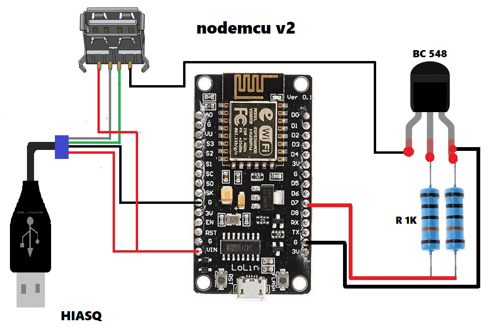
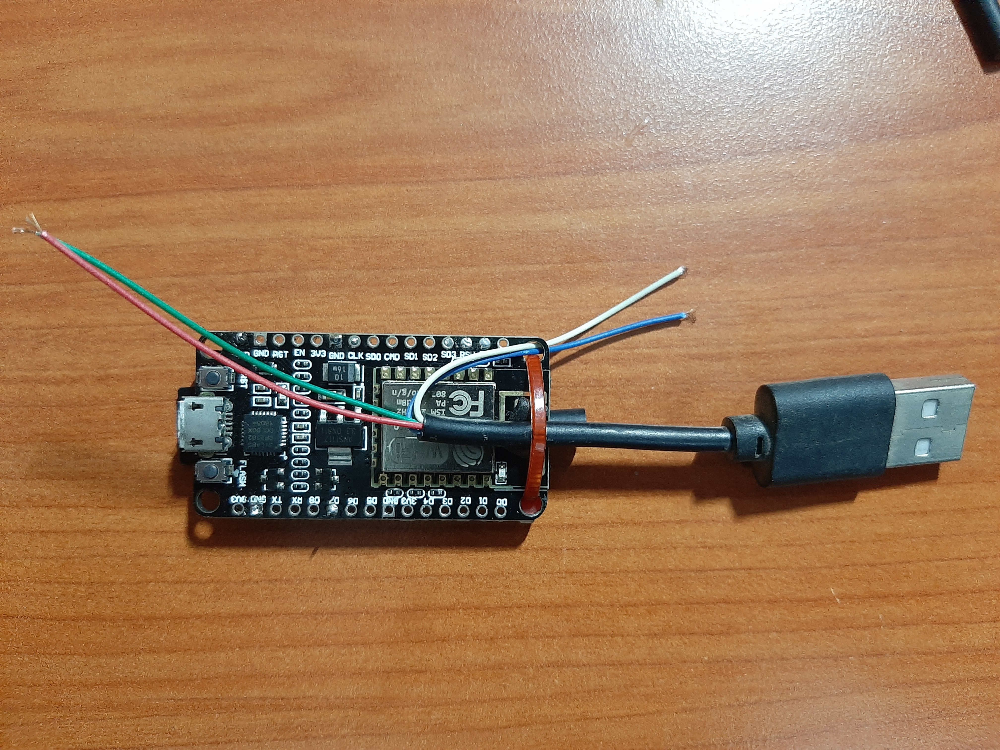
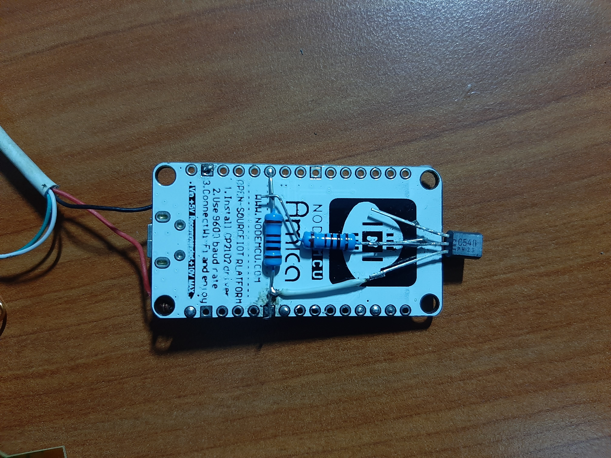
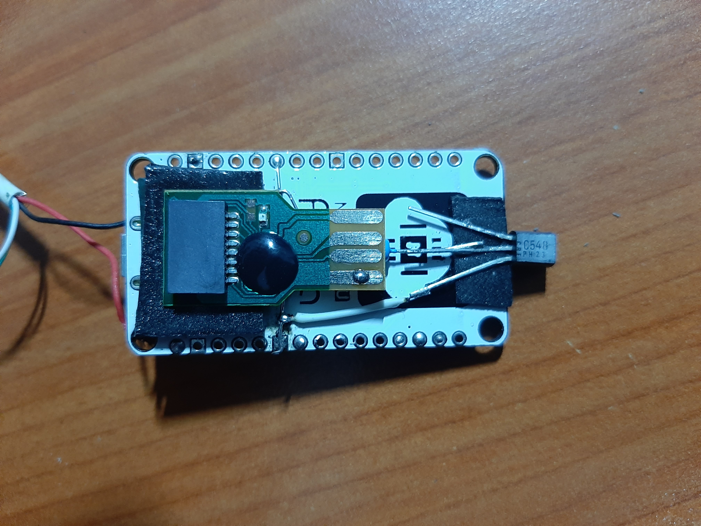
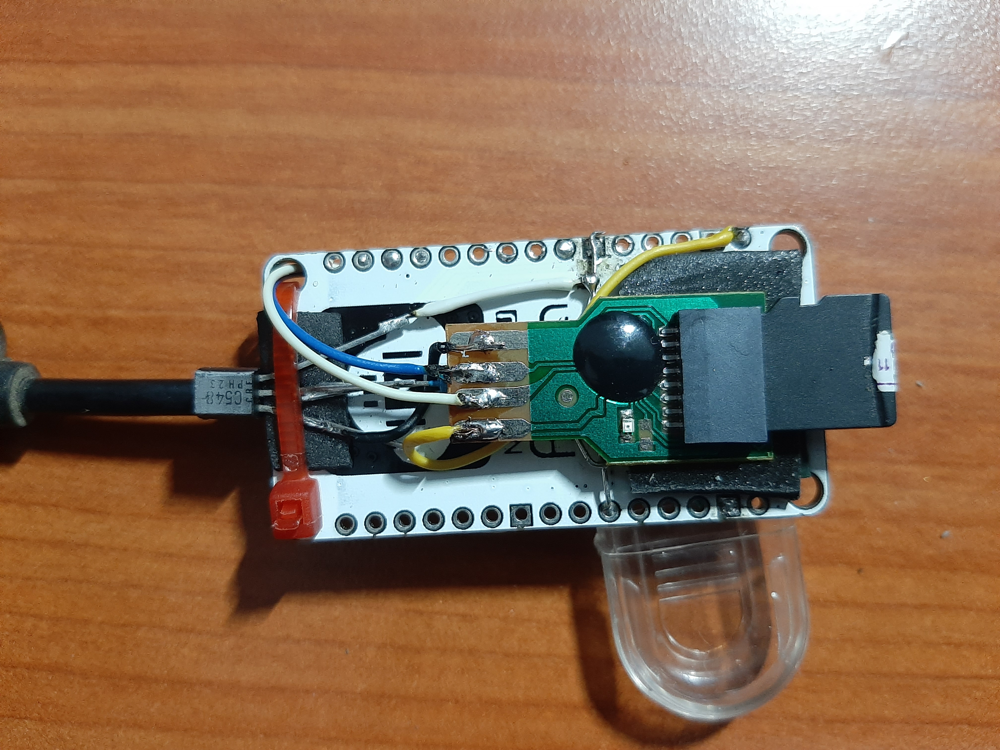
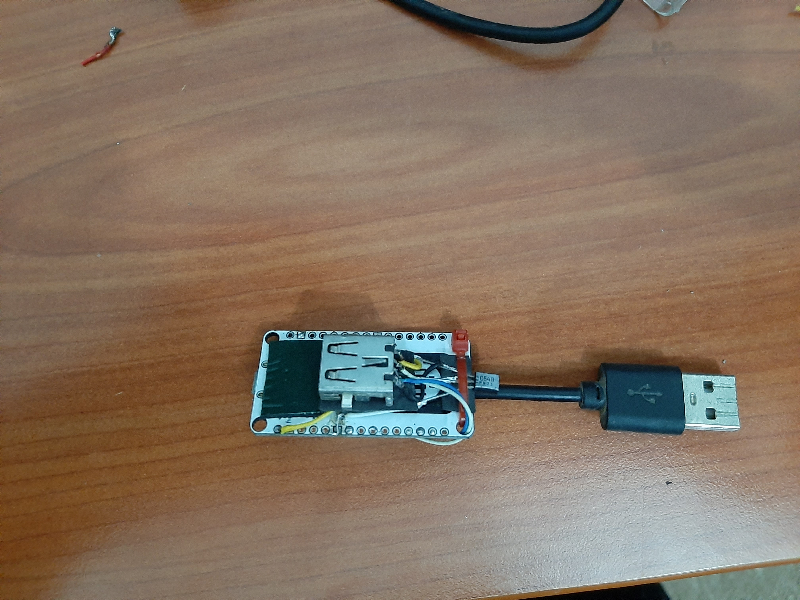
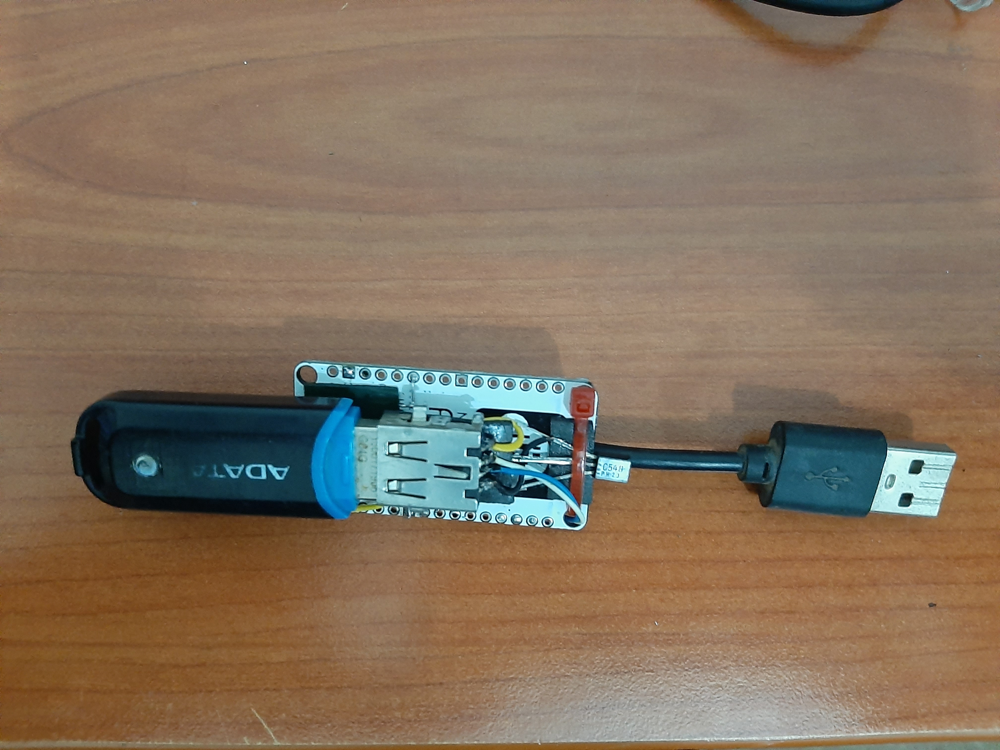

# PS4-Server-9.00u

The original method BY: [stooged](https://github.com/stooged/PS4-Server-900u) using [Wemos D1 mini module (ESP-8266)](https://www.researchgate.net/profile/Arthur-Bucioli/publication/333686151/figure/fig2/AS:768589330137089@1560257384094/Wemos-D1-mini-module-ESP-8266.ppm)

I tried the method on NodeMcu v2 "ESP8266" and it worked too.
 

## Micro SD Reader
 
 
 
 

## USB Flash Drive
 
 

